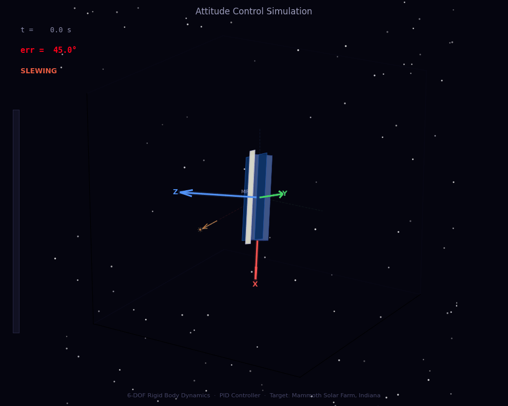
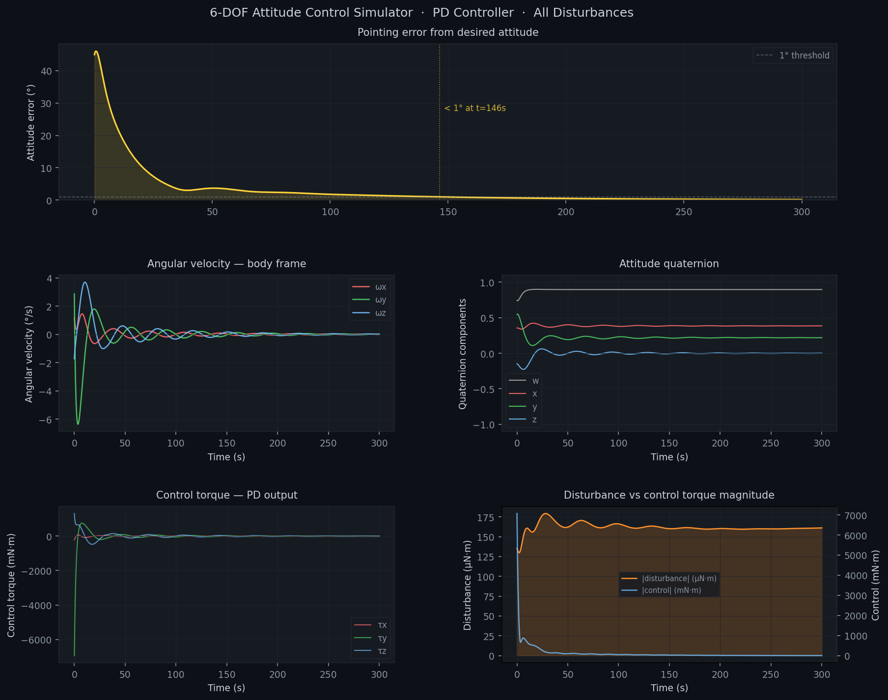
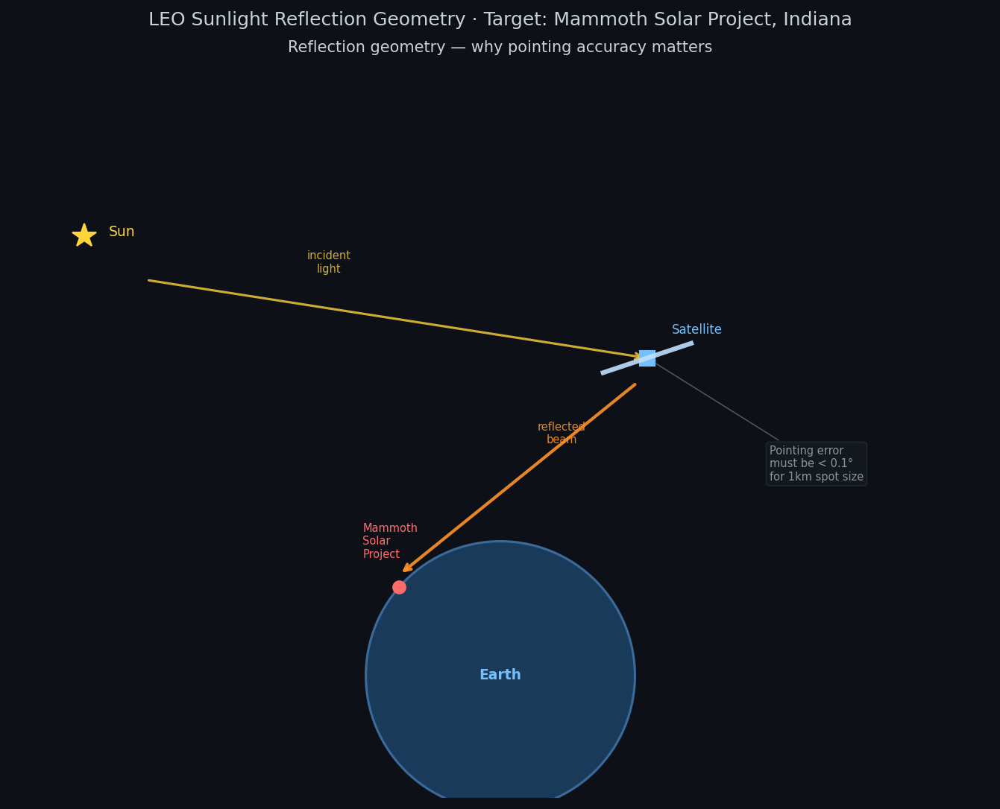

# 6-DOF Attitude Control Simulator



A physics-accurate spacecraft attitude control simulator built from scratch in Python. Models rigid body rotational dynamics, environmental disturbance torques, and a PID controller driving a satellite to a mission-specific pointing attitude — targeting the [Mammoth Solar Project](https://en.wikipedia.org/wiki/Mammoth_Solar) in Starke County, Indiana, with a deployable mirror reflector.

---

## What it simulates

The simulator integrates two coupled equations of motion simultaneously at every timestep:

**Euler's rotation equation** — how applied torques change angular velocity:

$$\dot{\omega} = I^{-1} \left( \tau_{ctrl} + \tau_{dist} - \omega \times I\omega \right)$$

**Quaternion kinematics** — how angular velocity changes attitude:

$$\dot{q} = \frac{1}{2} \, \Omega(\omega) \, q$$

Both are integrated with a 4th-order Runge-Kutta (RK4) scheme. Attitude is represented entirely in unit quaternions — no gimbal lock, singularity-free at all orientations.

---

## Results

| Metric | Value |
|---|---|
| Satellite mass | 150 kg |
| Mirror area | 50 m² |
| Orbital altitude | 500 km LEO |
| Initial pointing error | 45° |
| Settling time (< 1°) | ~140 s |
| Final pointing error | < 1° |
| Controller | PID with anti-windup + integrator deadband |



---

## Disturbance environment

Four environmental torques act simultaneously on the satellite:

**Solar radiation pressure** — photon momentum transfer on the mirror surface. The dominant disturbance for large reflective satellites. Torque magnitude:

$$\tau_{SRP} = \frac{\Phi}{c} \cdot C_r \cdot A \cdot \cos\theta \cdot d_{CoP}$$

With a 50 m² mirror and 30 cm CoM–CoP offset this produces ~12 mN·m — the primary load the controller fights.

**Gravity gradient** — differential gravitational pull across an elongated body. Tries to align the minimum inertia axis with the local vertical. Scales as $3\mu / 2r^3$.

**Magnetic disturbance** — residual onboard dipole moment interacting with Earth's field via $\tau = m \times B$.

**Aerodynamic drag** — residual atmosphere at 500 km produces a small but persistent drag torque. Scales exponentially with decreasing altitude.

---

## Controller

A PID controller with two stability features:

```python
# Integrator deadband: only accumulate when close to target
# Prevents windup during large slews
if err_deg < 5.0:
    integral += err_vec * dt

# Anti-windup clamp: integral torque never exceeds actuator limit
if |Ki @ integral| > tau_max * 0.5:
    integral *= (tau_max * 0.5) / |Ki @ integral|

tau = Kp @ err_vec + Ki @ integral - Kd @ omega
```

Gains are derived from desired closed-loop dynamics:

$$K_p = \omega_n^2 \cdot I \qquad K_d = 2\zeta\omega_n \cdot I \qquad K_i = \omega_n \cdot k_i \cdot I$$

With $\omega_n = 0.5$ rad/s and $\zeta = 0.7$ (critically damped).

---

## Pointing geometry

The desired attitude is computed from the specular reflection condition. For sunlight to reach the target, the mirror normal must bisect the angle between the sun vector and the target vector:

$$\hat{n}_{mirror} = \frac{\hat{s}_{sun} + \hat{t}_{target}}{|\hat{s}_{sun} + \hat{t}_{target}|}$$

This normal is then converted to a target quaternion using Rodrigues' rotation formula, mapping body Z onto $\hat{n}_{mirror}$.



---

## Project structure

```
attitude-sim/
├── rigid_body.py       — inertia tensor, quaternion math, Euler's equation, RK4
├── simulator.py        — simulation loop, state logging, diagnostic plots
├── pid_controller.py   — PID controller with anti-windup and deadband
├── disturbances.py     — SRP, gravity gradient, magnetic, aerodynamic torques
└── visualization.py    — animated GIF, summary plot, reflection geometry
```

Each file is independently runnable with built-in sanity checks:

```bash
python rigid_body.py      # quaternion norm check, stable spin test
python simulator.py       # static drift check, linear spin-up accuracy
python pid_controller.py  # convergence test at 45°, 90°, 180° initial errors
python disturbances.py    # torque magnitude samples, 60s convergence check
python visualization.py   # generates all three output files
```

---

## Installation

```bash
git clone https://github.com/rpodder1/Satellite-Control-Simulator
cd Satellite-Control-Simulator
pip install numpy matplotlib pillow
python visualization.py
```

Requires Python 3.9+. No other dependencies.

---

## Key concepts demonstrated

- **Quaternion attitude representation** — scalar-first convention, singularity-free integration, shortest-path error computation
- **6-DOF rigid body dynamics** — gyroscopic coupling, intermediate axis theorem, torque-free precession
- **RK4 numerical integration** — quaternion normalization at each substep to prevent drift
- **Environmental disturbance modeling** — SRP with Lambertian illumination factor, orbital mechanics for time-varying nadir/sun/velocity vectors
- **PID gain design** — natural frequency and damping ratio formulation, anti-windup clamping, integrator deadband
- **Specular reflection geometry** — bisector construction for mirror pointing, Rodrigues' rotation formula for quaternion computation
